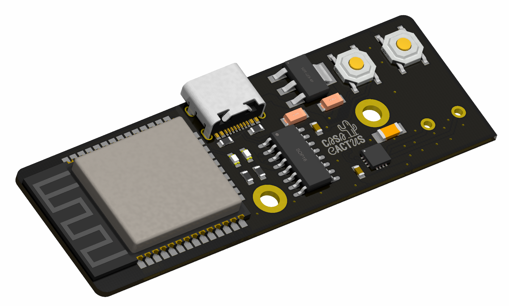
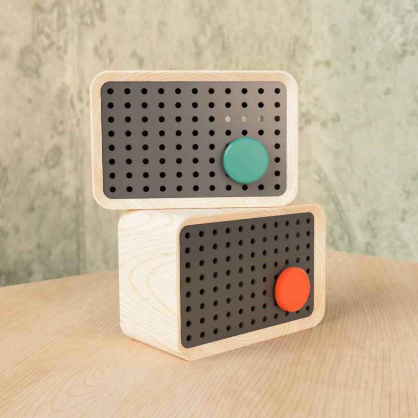
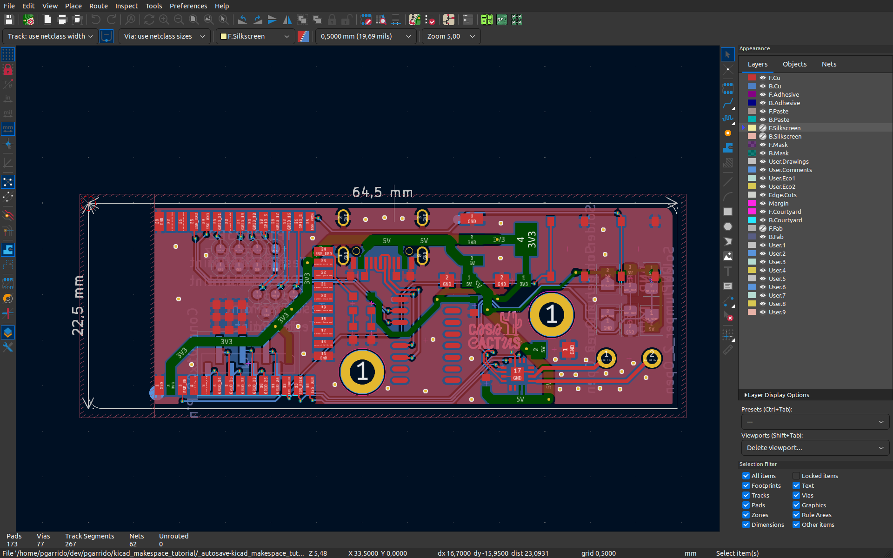
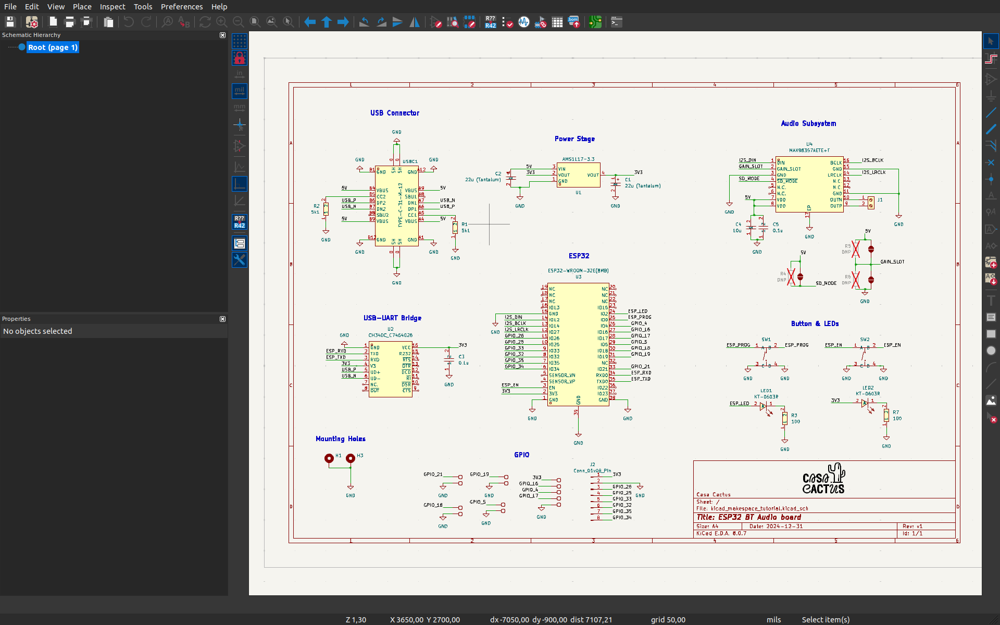

# Casa Cactus Speaker

Repository for a project featuring an ESP32-S3 and an I2S Class D amplifier for audio playback.

Created for a Makespace Madrid session to demonstrate a complete PCB design workflow, from schematic to JLCPCB fabrication.

**Companion slides: [here](https://docs.google.com/presentation/d/1glYFRo9XCKRI-qDjp1DA8M3mJohLk-lrxx0JoBPsboM/edit#slide=id.p)**

